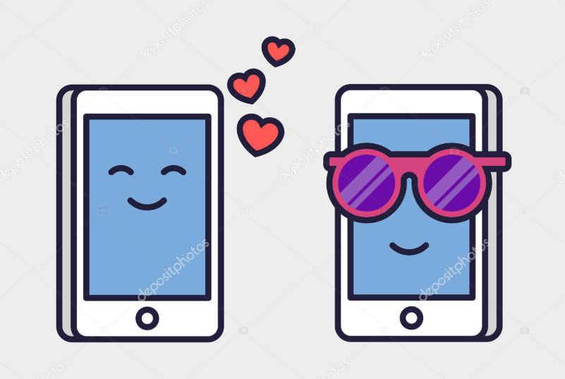
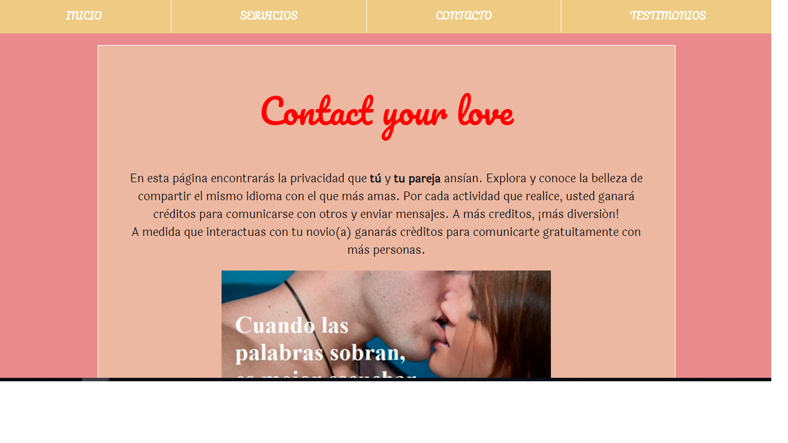
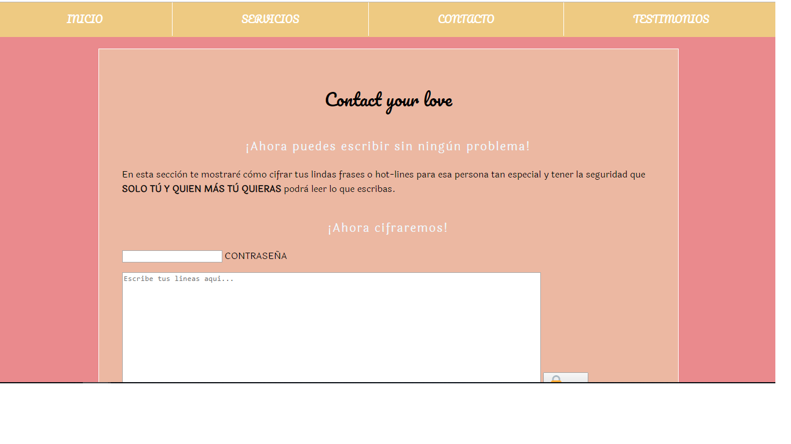
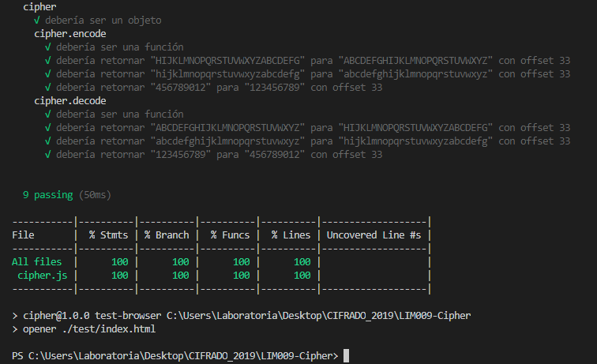

# Contact your love

## Introducción

Contact your love es tu mensajero confidencial. Una herramienta que permitirá a los usuarios proteger la privacidad de sus mensajes, al contar con una plataforma capaz de cifrar y descifrar texto mediante la sustitución alfabética simple.

Contact your love va dirigido a todas las personas que tienen un particular interés de comunicarse mediante textos cifrados con fin de proteger su privacidad. Esta aplicación web es la solución al problema de aquellos que sientan preocupación por el hecho de que un tercero pueda leer sus conversaciones privadas, ya que al cifrar el mensaje, en pantalla solo aparecerá una sucesión de números o caracteres sin sentido, y para poder interpretarlo (descifrarlo) será necesario conocer el código secreto.

## Proceso de diseño
### Descubrimiento e investigación

Dado que la información que se envía a través de Internet en algunos casos puede ser accedida por intrusos, el cifrado de datos es una alternativa para mantener la privacidad. 

Cifrando tus mensajes, evitas otro tipo de ataques como el robo de identidad, fraudes bancarios, además de brindar un mecanismo de protección ante el robo o pérdida de dispositivos con información sensible.

### Ideación
  ¡Se utilizaron sketches, y fluyeron las ideas! Se tuvo como propósito construir una web con un diseño práctico, interfaz didáctica, fácil de usar y amigable, que permita al usuario cifrar/descifrar texto, codificando información sensible para posteriormente poder envíar el resultado a sus contactos con total seguridad, utilizando una clave secreta.

### Prototipado

Se elaboró un prototipo práctico, se tuvo como finalidad cumplir con los siguientes objetivos:

- Permitir al usuario cifrar y descifrar textos para luego ser enviados.
- Contar con una interfaz agradable, práctica y fácil de usar.s
- Que la funcionalidad sea del 100%
- Didáctica
- Indicaciones de Uso
- Responsive

#### Diseño final
Para laptops, computadoras:

Se utilizó responsive. Usado actualmente por parejas de toda edad, el cual envía el mensaje cifrado adjuntando el link de Hidden App, para que la persona que lo reciba, ingrese a la aplicación y pueda descifrar el contenido ingresando la clave secreta.

## HTML

En relacion al HTML, manejé una estructura básica de entrada y salida de texto, contiene:

> **Input 'enter-text'** Contiene el valor de la entrada de texto

  

> **input-offset** Hace referencia a la Clave Secreta, contiene el valor del desplazamiento a utilizarse para la fórmula del cifrado / descifrado

> **Boton 'Cifrar'** Para invocar a la función encode

   

> **Boton 'Descifrar'** Para invocar a la función decode

## JS

Contiene la funcion del cifrado y el descifrado y los eventos DOM

- Funciones:
Encode y Decode: Se considera valor de entrada (enter-text) y como valor del retorno (result). Se utilizó la herramienta del bucle para el recorrido de la cadena. Se utilizó una fórmula matemática para aplicar el 'Crifrado de cesar' ((x- 65 + offSet) % 26 + 65). Esta realizado en funcion al ASCCI

## CSS

Basado en un diseño práctico, interfaz didáctica, amigable y fácil de usar.

Se utilizo responsive para equipos moviles, teniendo en cuenta que la aplicación web sera usada en celulares.

## Test

Para se utilizó el Node JS, implementando los posibles escenarios en base a la usuabilidad del aplicativo web.

Obteniendo el siguiente resultado:

## Instalación / Uso

Puedes acceder a la aplicación desde tu laptop / tablet o celular desde el siguiente link:
https://melissasalazare.github.io/LIM009-Cipher/src/#

Te invito a seguir los siguientes pasos para mejorar tu experiencia utilizando Contact your love :

1. Ingresa tu mensaje
2. Crea / Ingresa tu Clave secreta: Esta será la llave necesaria para que tu destinatario pueda descifrar el contenido e interprete tu mensaje oculto!
3. Presiona cifrar y luego envía el mensaje codificado a tus amigos!

Recuerda que para descifrarlo, tendrán que utilizar la misma clave utilizada para el cifrado.

¡Que te diviertas!  
